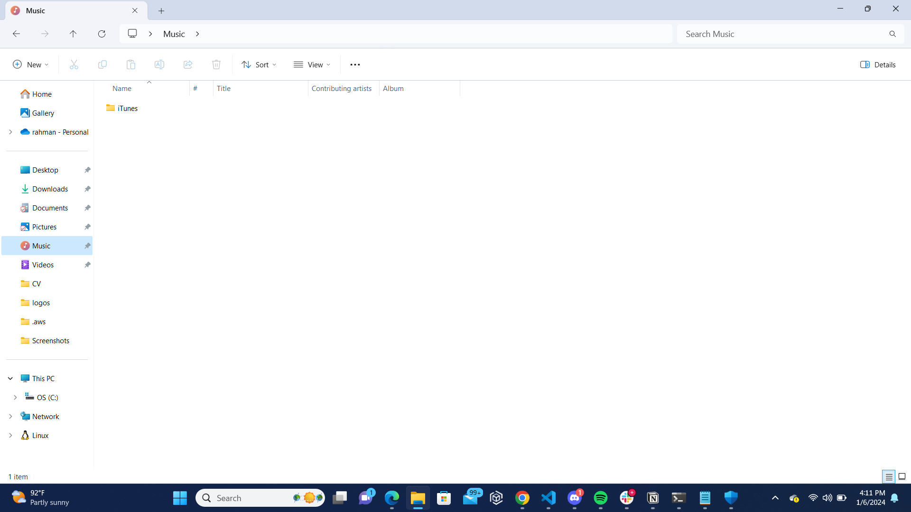

# Writing Good Documentation


## Step 1 - Using Codeblocks

Codeblocks in markdown make it *easy* to **copy,paste and share** code

A good __Cloud Engineer__ uses codeblocks whenever possible.

Because it allows others to copy and paste their code to replicate or research issues.


- In order to create codeblocks in markdown, you need to use three backticks (```)
- Not to be confused with single quotations. (')
  
```
def factorial(n):
    if n == 0 or n == 1:
        return 1
    else:
        return n * factorial(n-1)

# Example usage
number = 5
result = factorial(number)
print(f"The factorial of {number} is: {result}")
```

- When you can , you should attempt to apply syntax highlighting to codeblocks

```python
def factorial(n):
    if n == 0 or n == 1:
        return 1
    else:
        return n * factorial(n-1)

# Example usage
number = 5
result = factorial(number)
print(f"The factorial of {number} is: {result}")
```

Make note of where the backtick button is located, it should be above tab key.
it may vary based on keyboard type.


Good cloud engineers use codeblocks for both code and errors that appearin the console.

>Here is an example of using a codeblock for an error that appears in bash

```bash
TypeError: can only concatenate str (not "int") to str
```
## Step 2 - Using Screenshots

Don't take screenshots using your phone

## Step 3 - Use Github Flavored Markdown task lists

Github extends Markdown to have a list where you can check off items <sup>[1]</sup>

- [x] Finish Step 1
- [ ] Finish Step 2
- [ ] Finish Step 3

## Step 4 - Use Emojis

GFM (Github Flavored Markdown) Supports emojis shortcodes.
Here are some examples

| Name | shortcode | emoji |
| --- | --- | --- |
| Clouds | `:cloud:` | :cloud: |
| Cloud with lightning | `:cloud_with_lightning:`| 🌩️

:cloud:

## Step 5 - How to create a table

You can use the following markdown format to create tables

```md
| Name | shortcode | emoji |
| --- | --- | --- |
| Clouds | `:cloud:` | :cloud: |
| Cloud with lightning | `:cloud_with_lightning:`| 🌩️
```
Github extends the functionality of Markdown tables to provide more alignment and table cell formatting options. [<sup>[2]</sup>](#external-references)



[Secret Window Hidden Garden](secret-window/hidden-garden.md)

## External References

- [Basic writing and formatting syntax](https://docs.github.com/en/get-started/writing-on-github/getting-started-with-writing-and-formatting-on-github/basic-writing-and-formatting-syntax#images) 
- [GitHub Flavored Markdown Spec](https://github.github.com/gfm/)
- [GFM - Task Lists](https://docs.github.com/en/get-started/writing-on-github/getting-started-with-writing-and-formatting-on-github/basic-writing-and-formatting-syntax#task-lists) <sup>[1]</sup>
- [Github emoji cheat sheet](https://github.com/ikatyang/emoji-cheatsheet/blob/master/README.md)
- [Github Markdown Creating a Table](https://github.github.com/gfm/#tables-extension-) <sup>[2]</sup>

